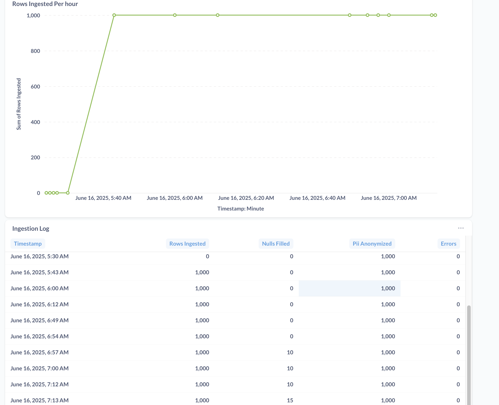

# ELT Pipeline: Customer Churn Analysis

This project demonstrates a containerized ELT (Extract, Load, Transform) pipeline for analyzing customer churn using PostgreSQL, Apache Airflow, and Metabase — all running locally using Docker.

---

## Stack Overview

* **PostgreSQL**: Relational database used for staging and reporting
* **Airflow**: DAG-based orchestration for ingestion and transformation
* **Metabase**: Open-source BI tool for dashboarding and reporting

---

## Getting Started

### 1. Clone the Repository

```bash
git clone https://github.com/draina1901/customer_churn_elt
cd customer_churn_elt
```

### 2. Start All Services

```bash
docker compose up
```

> This will spin up PostgreSQL (port: 6543), Airflow (port: 8080), and Metabase (port: 3000).

---

## 🗃️ PostgreSQL Setup

### 3. Connect to PostgreSQL

Use your preferred SQL client and connect using:

```
Host: localhost
Port: 6543
Database: postgres
Username: myuser
Password: password123
```

### 4. Run the Following SQL Setup Script

```sql
-- Create Databases
CREATE DATABASE cust_churn_stg;
CREATE DATABASE cust_churn_rep;

-- Create User Database
CREATE DATABASE myuser;

-- Switch to staging DB and create customers table
\c cust_churn_stg;

CREATE TABLE customers (
    CustomerID INT PRIMARY KEY,
    Age INT,
    Gender VARCHAR(10),
    Tenure INT,
    MonthlyCharges DECIMAL(6, 2),
    ContractType VARCHAR(20),
    InternetService VARCHAR(20),
    TotalCharges DECIMAL(10, 4),
    TechSupport VARCHAR(3),
    Churn VARCHAR(3)
);

-- Switch to staging DB and create customers table
\c cust_churn_rep;

CREATE TABLE customers (
    CustomerID INT PRIMARY KEY,
    Age INT,
    Gender VARCHAR(10),
    Tenure INT,
    MonthlyCharges DECIMAL(6, 2),
    ContractType VARCHAR(20),
    InternetService VARCHAR(20),
    TotalCharges DECIMAL(10, 4),
    TechSupport VARCHAR(3),
    Churn VARCHAR(3)
);
```

---

## Restart Container

After creating databases and tables, restart the containers to ensure all services sync correctly:

```bash
docker compose down
docker compose up
```

---

##  Access the DAG

* **Airflow UI**: [http://localhost:8080](http://localhost:8080)
DAG Name : Job_dag

---

## Metabase Dashboards

Due to container-bound Metabase dashboards, public hosting isn't supported in this setup.
In a production setup, Metabase would be hosted on **AWS ECS or EC2** with proper reverse proxying and authentication.

### Dashboard Screenshots




